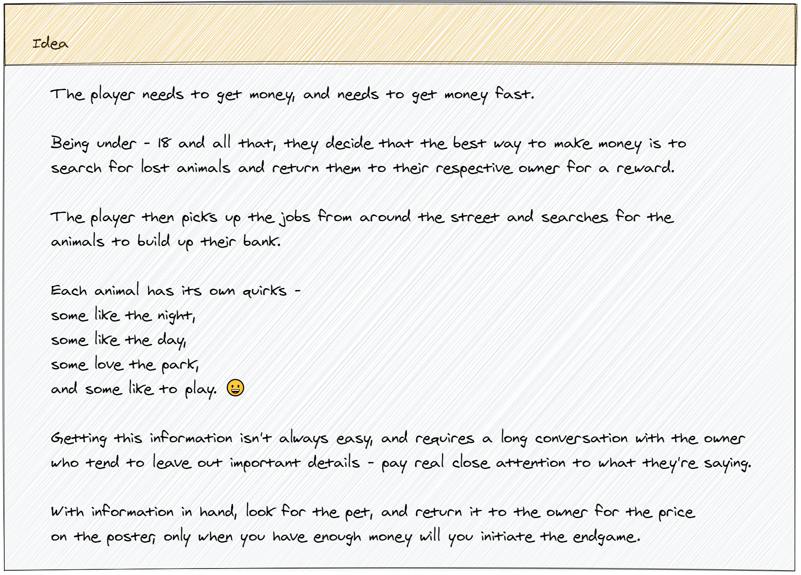
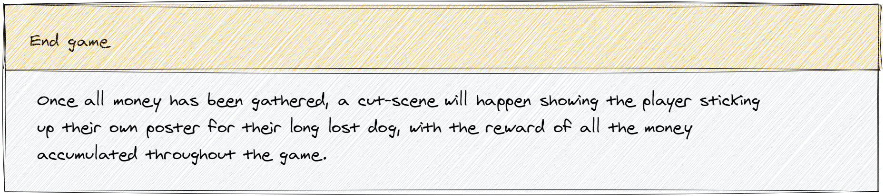

[See the idea](#the-idea) for information about the game play.

Several areas in the game where pets can be found include:
- Forest
- Park
- Alley

In these areas, not much can be done other than luring pets given a set of information.

Key areas in the game include:

### The street
The main hub for quests.
All NPCs will be here, perhaps wandering the streets, looking for their pet.
You can interact with each NPC for [information](#pet-information) about their pet, maybe even a photograph.

Once a pet is found, it must be returned to the correct NPC in the street for the reward!

### The pet shop
The pet shop will be an area of interest which allows the purchase of items that can be used on your search.  
Some pets may only come if a correct item is used, and you may even scare a pet off if you use something it hates!

## Pet Information
Some pet information such as:

- Color
- Name
- Likes
- Last Seen

# Images

## The Idea

## The End Game

## The Game Flow

## The Game Areas
